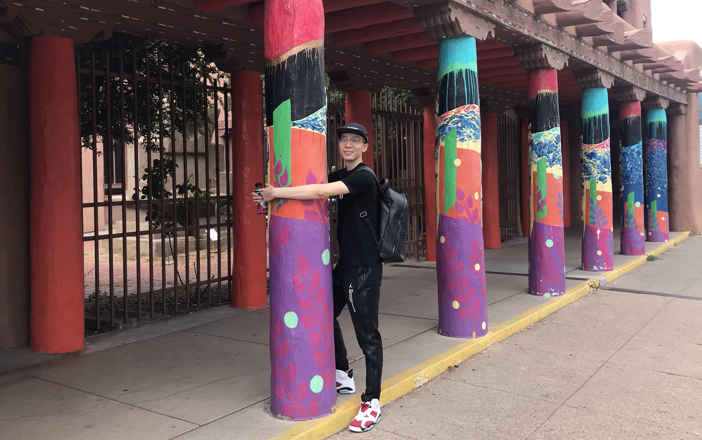

<link rel="stylesheet" href="academicons.css"/>
<link rel="stylesheet" href="styles.css" type="text/css"/>

***

<h3> Ph.D. candidate in Biostatistics at Columbia University </h3> 

 

I'm a second-year Ph.D. student in Biostatistics at Columbia University Mailman School of Public Health.

<!--
<c1> [Research Projects](research.html) </c1> | <c1> [Class Projects](overview.html) </c1> | <c1> [Relevant Coursework](coursework.html) </c1>
:--------------------------: | :------------------------: | :------------------------:
-->

<h3> Contact Information:  </h3>

Jia Guo, M.S.  
Ph.D. candidate  
Department of Biostatistics  
[Columbia University Mailman School of Public Health](http://www.mailman.columbia.edu)  
722 West 168th Street, New York, NY 10032  
jg3780@cumc.columbia.edu

